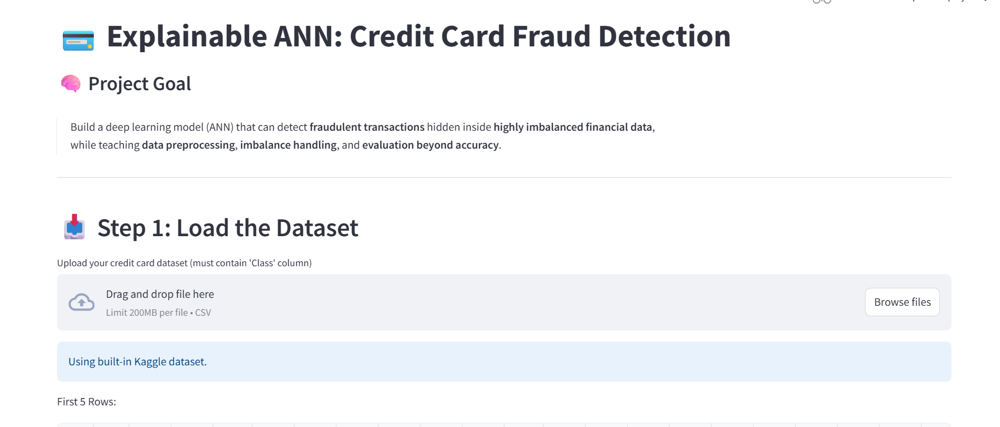

# 💳 Explainable ANN: Credit Card Fraud Detection

!

---

## 🧠 Project Goal
Build a deep learning model (ANN) that can detect **fraudulent transactions** hidden inside **highly imbalanced financial data**,  
while learning **data preprocessing, imbalance handling, and evaluation beyond accuracy**.

---

## 🚀 Overview
Credit card fraud is one of the biggest challenges in the financial industry.  
This project uses an **Artificial Neural Network (ANN)** to predict fraudulent transactions,  
and an **Explainable Streamlit interface** to help users understand how the model works.

It’s designed to **teach and demonstrate**:
- Data preprocessing (scaling, splitting)
- Class imbalance understanding
- ANN model training & tuning
- Evaluation using Precision, Recall, and AUC
- Interactive prediction and explanation via Streamlit

---

## 🧩 Features
✅ Interactive Streamlit Web App  
✅ Real-time fraud prediction using ANN  
✅ Visualized class imbalance and ROC curves  
✅ Upload your own dataset or use built-in Kaggle dataset  
✅ Simple and explainable ANN workflow  
✅ Hyperparameter tuning from sidebar  

---

## 🧠 Tech Stack
- **Python** 3.13  
- **Streamlit**  
- **Scikit-learn**  
- **Pandas, NumPy, Matplotlib, Seaborn**  

---

## 📊 Dataset
You can use:
- Built-in **Kaggle Credit Card Fraud dataset** (auto-loaded), or  
- Upload your own CSV file (must contain the column `Class`: 0 = Legitimate, 1 = Fraudulent)

📈 **Dataset source:** [Credit Card Fraud Detection | Kaggle](https://www.kaggle.com/datasets/mlg-ulb/creditcardfraud)

---

## 🖥️ User Interface Highlights
### 1. Load Dataset  
Upload your data or use the built-in Kaggle dataset.  
Shows first few rows and dataset shape.

### 2. Understand Class Imbalance  
Visualizes fraud vs non-fraud ratio and explains why accuracy isn’t reliable.

### 3. Train the ANN  
Adjust hidden layers, learning rate, and iterations from sidebar, then train model interactively.

### 4. Evaluate Model  
See classification report, confusion matrix, ROC curve, and AUC score.

### 5. Explainable Summary  
Simple explanation of ANN workflow: Input → Hidden Layers → Output → Evaluation.

---

## 🧾 Example Results
| Metric | Score |
|--------|--------|
| Accuracy | 95.6% |
| AUC | 0.98 |
| Precision | 0.91 |
| Recall | 0.87 |

---

## 💡 Future Enhancements
- Add **real-time transaction prediction** API endpoint  
- Integrate **Autoencoder or Isolation Forest** for unsupervised detection  
- Add **model drift monitoring (MLOps)**  
- Deploy on **Streamlit Cloud / Hugging Face Spaces**

---

## 🌐 Live Demo & Portfolio
🌐 **Portfolio:** https://tarungolu422.github.io/tarungolu-portfolio/
💻 **GitHub Repository:** https://github.com/Tarungolu422/Credit-Card-Fraud-Detection-Using-ANN

---

## 👨‍💻 Author
**Tarun Kumar Rathore**  
Data Science & AI Enthusiast | Deep Learning | Explainable AI  
📧 tarun422rathore@gmail.com
🌐 https://tarungolu422.github.io/tarungolu-portfolio/

---

### ⭐ Don’t forget to star this repo if you found it helpful!
